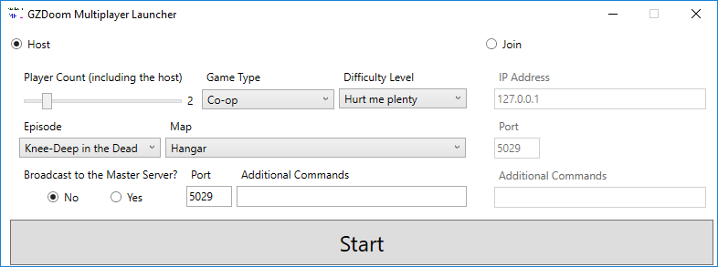

# GZDoom Multiplayer Launcher

Simple Multiplayer Launcher for GZDoom found here: [https://zdoom.org/index](https://zdoom.org/index)

## Features

- Hover over elements to find out more about it
- Host or Join
- Number of Players (1-8)
- Game Type (Co-op, Deathmatch, Alternative Deathmatch)
- Difficulty Level (1-5)
- Episode Selector (1-4)
- Map Selector (1-9)
- Broadcast to Master Server?
- IP Address
- Port Number
- Additional Commands

## Usage

Place GZDoom Multiplayer Launcher in the root directory of your gzdoom folder then run.

## Limitations/Future Improvements

- Currently only works on Doom shareware version, Doom full version, and Doom Ultimate with the default wad being loaded automatically. This can be overwritten with the additional commands option but the episode and map you play on cannot.

